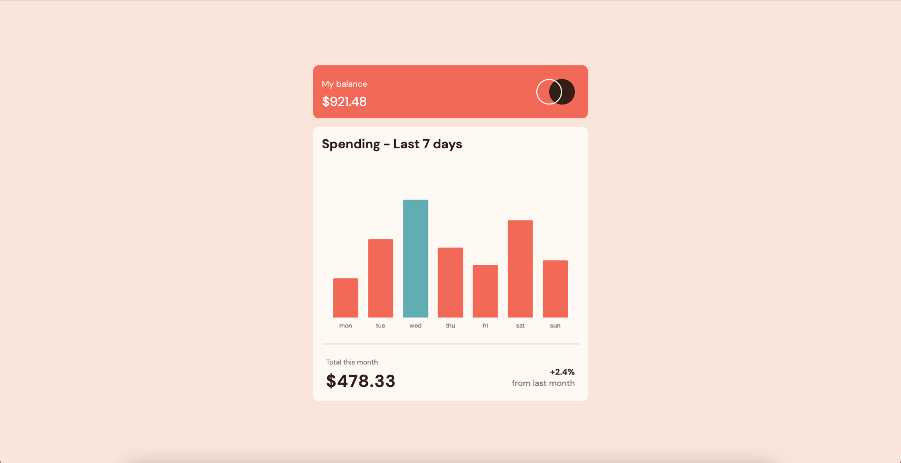

# Frontend Mentor - Expenses chart component solution

This is a solution to the [Expenses chart component challenge on Frontend Mentor](https://www.frontendmentor.io/challenges/expenses-chart-component-e7yJBUdjwt). Frontend Mentor challenges help you improve your coding skills by building realistic projects. 

## Table of contents

- [Overview](#overview)
  - [The challenge](#the-challenge)
  - [Screenshot](#screenshot)
  - [Links](#links)
- [My process](#my-process)
  - [Built with](#built-with)
  - [What I learned](#what-i-learned)
  - [Useful resources](#useful-resources)
- [Author](#author)
- [Acknowledgments](#acknowledgments)

## Overview

I really enjoyed this challenge. I decided to use Chart.js to build the chart so I could display the JSON data dynamically. This brought on a lot of challenges which led to a lot of great learning that I am very grateful for. I look forward to using Chart.js on more projects in the future.

### The challenge

Users should be able to:

- View the bar chart and hover over the individual bars to see the correct amounts for each day
- See the current day’s bar highlighted in a different colour to the other bars
- View the optimal layout for the content depending on their device’s screen size
- See hover states for all interactive elements on the page
- **Bonus**: Use the JSON data file provided to dynamically size the bars on the chart

### Screenshot

### Links

- Solution URL: https://github.com/timbosTours/Frontend-Mentor-expenses-chart-challenge/settings/pages
- Live Site URL: https://timbostours.github.io/Frontend-Mentor-expenses-chart-challenge/

## My process
I went for a mobile first approach, working top down I started with styling the balace div then moved onto the totals and then to the chart. I spent most of the project working in Chart.js. First getting the data and appending it to the chart then I worked on styling the chart and adding the active states then finished with styling the tooltip box. Finally I added the media queries for the responsive desktop design.

### Built with

- Semantic HTML5 markup
- CSS custom properties
- Mobile-first workflow
- [Chart.js](https://www.chartjs.org/docs/latest/) - JS library

### What I learned

I learnt that I really enjoy Chart.js. I found having good documentation accompanied by some in depth youtube videos made it relatively easy to work with.

### Useful resources

The two resources I used the most were the Chart.js docs.

- https://www.chartjs.org/docs/latest/

And the Chart.js tutorials youtube channel.

-https://www.youtube.com/c/ChartJS-tutorials

## Author

- Website - https://github.com/timbosTours
- Frontend Mentor - [@timbosTours](https://www.frontendmentor.io/profile/timbosTours)
- Twitter - [@timbosTours](https://www.twitter.com/timbosTours)

## Acknowledgments

Big thanks to Frontend Mentor and an even bigger thanks to anyone who takes the time to review my code.

Massive shout out to whoever is running this youtube channel. Could not have got through this project with out it!

- https://www.youtube.com/c/ChartJS-tutorials

